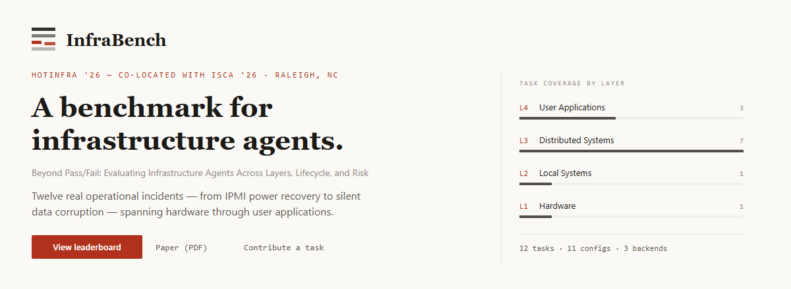
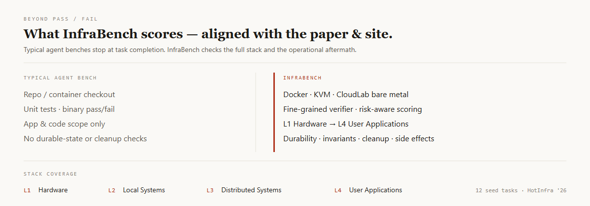

<!-- Hero image (PNG — GitHub README does not reliably render SVG) -->
<p align="center">
  <a href="https://xuanmiaog.github.io/InfraBench/">
    
  </a>
</p>

<p align="center">
  <a href="https://xuanmiaog.github.io/InfraBench/"><strong>View leaderboard ↓</strong></a>
  &nbsp;&nbsp;·&nbsp;&nbsp;
  <a href="https://hotinfra.org/2026/papers/hotinfra26-final71.pdf"><strong>Paper (PDF) →</strong></a>
  &nbsp;&nbsp;·&nbsp;&nbsp;
  <a href="CONTRIBUTING.md"><strong>Contribute a task →</strong></a>
</p>

<br />

<p align="center">
  
</p>

---

## 02 &nbsp; Curated tasks in this repo

This is the **public** InfraBench surface. Full task directories (instruction, environment, verifier) — the canonical package format. The evaluation runtime (**Syscraft**) is **not open-sourced here yet**.

| Task | Layer | Diff. | Backend |
|------|:-----:|:-----:|---------|
| [`hello-world`](tasks/hello-world/) | — | Easy | Docker · start here |
| [`ipmi-node-power-recovery`](tasks/ipmi-node-power-recovery/) | L1 | Easy | CloudLab |
| [`cassandra-nic-split-brain`](tasks/cassandra-nic-split-brain/) | L2 | Medium | CloudLab |
| [`cassandra-dead-node-removal`](tasks/cassandra-dead-node-removal/) | L3 | Medium | CloudLab |
| [`vm-ceph-bootstrap`](tasks/vm-ceph-bootstrap/) | L3 | Hard | VM cluster |
| [`db-wal-recovery`](tasks/db-wal-recovery/) | L4 | Hard | Container |

More of the 12-task HotInfra suite will land here over time · [`tasks/README.md`](tasks/README.md)

<details>
<summary><strong>Task package shape</strong></summary>

```
my-task/
├── task.toml          # env, resources, difficulty
├── instruction.md     # what the agent sees
├── environment/       # Dockerfile  —or—  setup.sh + bootstrap.sh
├── solution/          # optional reference solve.sh
└── tests/             # verifier → /logs/verifier/reward.{txt,json}
```

Authoring: [CONTRIBUTING.md](CONTRIBUTING.md) · [AGENTS.md](AGENTS.md)

</details>

---

## 03 &nbsp; Evaluation runtime

End-to-end runs use **Syscraft** (provisioning, fault scenarios, agent adapters).  
**That harness is not published in this repository yet.**

- Treat these tasks as **layout + verifier references** today.
- `hello-world` is the on-ramp for a future lightweight Docker runner.
- Need eval access? [Open an issue](https://github.com/XuanmiaoG/InfraBench/issues) or contact the authors in the paper.

```
InfraBench/
├── tasks/           curated packages
├── CONTRIBUTING.md  write a task
├── AGENTS.md        agent authoring notes
├── paper/           HotInfra '26 PDF
└── docs/            project website (GitHub Pages)
```

---

## 04 &nbsp; Citation

```bibtex
@inproceedings{infrabench2026,
  title     = {InfraBench: A Benchmark for Infrastructure Agents},
  booktitle = {Workshop on Hot Topics in System Infrastructure (HotInfra)},
  year      = {2026},
  note      = {Co-located with ISCA '26},
  url       = {https://hotinfra.org/2026/papers/hotinfra26-final71.pdf}
}
```

Copy author fields from the [camera-ready PDF](paper/hotinfra26-final71.pdf) when citing formally.

---

## Acknowledgments

- **Task interviews:** [CHTC](https://chtc.cs.wisc.edu/) · [DoIT](https://it.wisc.edu/about/division-of-information-technology/) (UW–Madison)
- **Compute:** [CloudLab](https://www.cloudlab.us/) · [ARA Wireless Living Lab](https://arawireless.org/)
- **API credits:** [Google Gemini Academic Program](https://ai.google.dev/gemini-api/docs/gemini-for-research)

---

<p align="center">
  <a href="https://xuanmiaog.github.io/InfraBench/">Site</a>
  ·
  <a href="https://hotinfra.org/2026/papers/hotinfra26-final71.pdf">Paper</a>
  ·
  <a href="CONTRIBUTING.md">Contribute</a>
  ·
  <a href="LICENSE">Apache 2.0</a>
</p>

<p align="center">
  <sub>University of Wisconsin–Madison · Iowa State University</sub>
</p>
