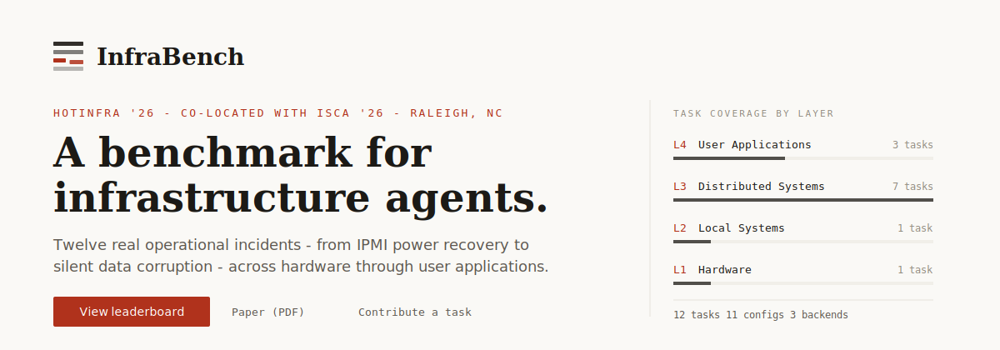
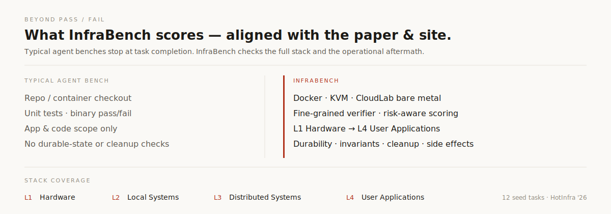

<!-- Hero — mirrors the project site first viewport (SVG, GitHub-safe HTML) -->
<p align="center">
  <a href="https://xuanmiaog.github.io/InfraBench/">
    
  </a>
</p>

<p align="center">
  <a href="https://xuanmiaog.github.io/InfraBench/"><strong>View leaderboard ↓</strong></a>
  &nbsp;&nbsp;·&nbsp;&nbsp;
  <a href="https://hotinfra.org/2026/papers/hotinfra26-final71.pdf"><strong>Paper (PDF) →</strong></a>
  &nbsp;&nbsp;·&nbsp;&nbsp;
  <a href="CONTRIBUTING.md"><strong>Contribute a task →</strong></a>
</p>

<br />

<!-- Compare strip from site voice -->
<p align="center">
  
</p>

---

## 02 &nbsp; Curated tasks in this repo

This is the **public** InfraBench surface. Full task directories (instruction, environment, verifier) — the canonical package format. The evaluation runtime (**Syscraft**) is **not open-sourced here yet**.

<table>
  <thead>
    <tr>
      <th align="left">Task</th>
      <th align="center">Layer</th>
      <th align="center">Diff.</th>
      <th align="left">Backend</th>
    </tr>
  </thead>
  <tbody>
    <tr>
      <td><a href="tasks/hello-world/"><code>hello-world</code></a></td>
      <td align="center">—</td>
      <td align="center">Easy</td>
      <td>Docker · start here</td>
    </tr>
    <tr>
      <td><a href="tasks/ipmi-node-power-recovery/"><code>ipmi-node-power-recovery</code></a></td>
      <td align="center"><code>L1</code></td>
      <td align="center">Easy</td>
      <td>CloudLab</td>
    </tr>
    <tr>
      <td><a href="tasks/cassandra-nic-split-brain/"><code>cassandra-nic-split-brain</code></a></td>
      <td align="center"><code>L2</code></td>
      <td align="center">Medium</td>
      <td>CloudLab</td>
    </tr>
    <tr>
      <td><a href="tasks/cassandra-dead-node-removal/"><code>cassandra-dead-node-removal</code></a></td>
      <td align="center"><code>L3</code></td>
      <td align="center">Medium</td>
      <td>CloudLab</td>
    </tr>
    <tr>
      <td><a href="tasks/vm-ceph-bootstrap/"><code>vm-ceph-bootstrap</code></a></td>
      <td align="center"><code>L3</code></td>
      <td align="center">Hard</td>
      <td>VM cluster</td>
    </tr>
    <tr>
      <td><a href="tasks/db-wal-recovery/"><code>db-wal-recovery</code></a></td>
      <td align="center"><code>L4</code></td>
      <td align="center">Hard</td>
      <td>Container</td>
    </tr>
  </tbody>
</table>

<p>
  More of the 12-task HotInfra suite will land here over time ·
  <a href="tasks/README.md">tasks/README.md</a>
</p>

<details>
  <summary><strong>Task package shape</strong></summary>
  <br />

```
my-task/
├── task.toml          # env, resources, difficulty
├── instruction.md     # what the agent sees
├── environment/       # Dockerfile  —or—  setup.sh + bootstrap.sh
├── solution/          # optional reference solve.sh
└── tests/             # verifier → /logs/verifier/reward.{txt,json}
```

  <p>
    Authoring:
    <a href="CONTRIBUTING.md">CONTRIBUTING.md</a>
    ·
    <a href="AGENTS.md">AGENTS.md</a>
  </p>
</details>

---

## 03 &nbsp; Evaluation runtime

End-to-end runs use **Syscraft** (provisioning, fault scenarios, agent adapters).  
**That harness is not published in this repository yet.**

<ul>
  <li>Treat these tasks as <strong>layout + verifier references</strong> today.</li>
  <li><code>hello-world</code> is the on-ramp for a future lightweight Docker runner.</li>
  <li>Need eval access?
    <a href="https://github.com/XuanmiaoG/InfraBench/issues">Open an issue</a>
    or contact the authors in the paper.
  </li>
</ul>

<pre>
InfraBench/
├── tasks/           curated packages
├── CONTRIBUTING.md  write a task
├── AGENTS.md        agent authoring notes
├── paper/           HotInfra '26 PDF
└── docs/            project website (GitHub Pages)
</pre>

---

## 04 &nbsp; Citation

```bibtex
@inproceedings{infrabench2026,
  title     = {InfraBench: A Benchmark for Infrastructure Agents},
  booktitle = {Workshop on Hot Topics in System Infrastructure (HotInfra)},
  year      = {2026},
  note      = {Co-located with ISCA '26},
  url       = {https://hotinfra.org/2026/papers/hotinfra26-final71.pdf}
}
```

Copy author fields from the <a href="paper/hotinfra26-final71.pdf">camera-ready PDF</a> when citing formally.

---

<p align="center">
  <a href="https://xuanmiaog.github.io/InfraBench/">Site</a>
  ·
  <a href="https://hotinfra.org/2026/papers/hotinfra26-final71.pdf">Paper</a>
  ·
  <a href="CONTRIBUTING.md">Contribute</a>
  ·
  <a href="LICENSE">Apache 2.0</a>
</p>

<p align="center">
  <sub>University of Wisconsin–Madison · Iowa State University</sub>
</p>
